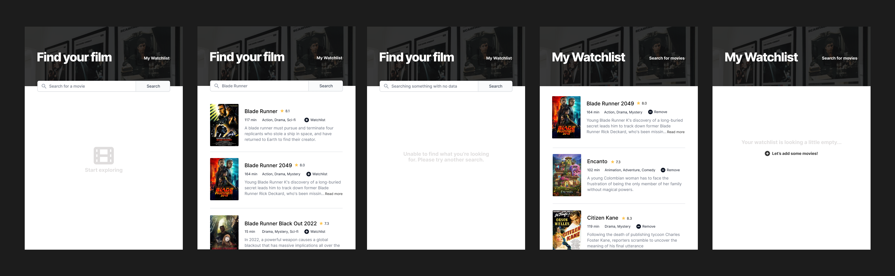

# scrimba-movies
Movie picker app for Scrimba Frontend course

## Design

## Requirements
- Two pages index.html, watchlist.html, following given UI design
- Index.html is a search page, where users can type search terms. The page must call the [OMDB API](https://www.omdbapi.com/) with title searched for, and display search results
- The movies displayed must have a button to "add to watchlist", which saves that data to local storage
- Watchlist.html loads and displays data from local storage
- Each movie on the watchlist must have a button to "remove from watchlist"